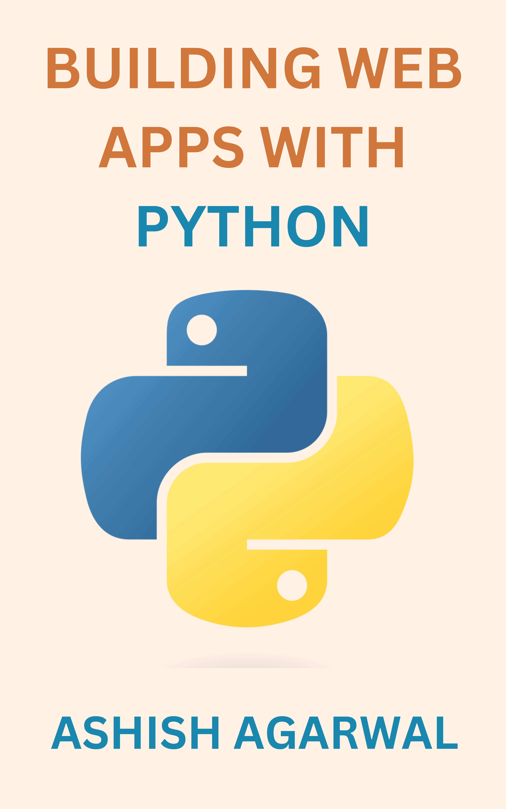

# What's this?
This is my book **Building Web Apps With Python**'s project files. Actually you need to do nothing out of these, I just want you to buy (or just check out) my new book.

It's about to be completed, and as soon as it is completed and published, I'll give you all here a small preview too. For the rest of time, view the book's cover (file ./Cover.png):

## Can I get a preview version?
Yes, I will give a 20% preview of the book as soon as I publish it. Wait till then!

## Where can I buy it?
I'll be uploading my book to Google Books and Google Play Store, I'll give you links as its published.

## What knowledge is needed?
You should have good knowledge in these topics to learn from this book (and to continue to make your own web apps):
- Python (Syntax, how to code, beginner knowledge) to learn Flask
- HTML (syntax) to learn Jinja
- You need to **have Python 3 installed*

## What will you teach?

You will learn these following topics:

- Install Flask
- Create a simple flask server
- HTTP Basics and how browsers work
- Jinja Templates
- Layout in Jinja
- Statics in Jinja
- Representing different data in Jinja
- Listing data
- Conditonal rendering
- Work with Form Data
- Protection against **XSS attacks**
- Flask & Jinja Concepts

And at last, you will build 2 different web apps under the Milestone section:
- Your personal website
- A to-do list web app